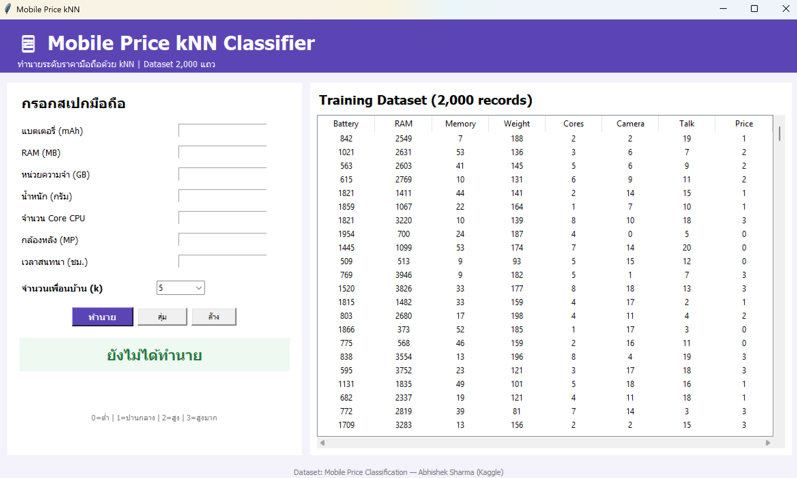

# 📱 Mobile Price kNN Classifier

โปรแกรมทำนายระดับราคามือถือด้วยอัลกอริทึม  
**k-Nearest Neighbors (kNN)** พัฒนาด้วย Python และ Tkinter

---

## 🖼️ ตัวอย่างโปรแกรม

---

## 📊 Dataset

ใช้ชุดข้อมูล **Mobile Price Classification — Abhishek Sharma**

Dataset:  
https://www.kaggle.com/datasets/iabhishekofficial/mobile-price-classification

ชุดข้อมูลมีประมาณ **2,000 records** และโปรแกรมเลือกใช้ 7 Features สำหรับการทำนาย

---

## 🔍 Features ที่ใช้

1. `battery_power` - ความจุแบตเตอรี่
2. `ram` - RAM
3. `int_memory` - หน่วยความจำภายใน
4. `mobile_wt` - น้ำหนักมือถือ
5. `n_cores` - จำนวน Core CPU
6. `pc` - กล้องหลัง
7. `talk_time` - ระยะเวลาสนทนา

---

## 🎯 ผลลัพธ์การทำนาย

โปรแกรมแบ่งระดับราคาออกเป็น 4 Class

- `0` = ราคาต่ำ
- `1` = ราคาปานกลาง
- `2` = ราคาสูง
- `3` = ราคาสูงมาก

---

## 🤖 k-Nearest Neighbors

ผู้ใช้สามารถเลือกค่า k ได้

`1, 3, 5, 7, 9, 11`

โปรแกรมใช้ `StandardScaler` เพื่อปรับสเกลข้อมูลก่อนนำไปใช้กับ kNN

Dataset ถูกแบ่งเป็น

- Training Data 80%
- Testing Data 20%

---

## ⚙️ วิธีติดตั้ง

แนะนำให้ใช้ **Python 3.11**

### 1. สร้าง Virtual Environment

    py -3.11 -m venv .venv

### 2. เปิดใช้งาน Virtual Environment

    .venv\Scripts\activate

### 3. ติดตั้ง Library

    pip install -r requirements.txt

---

## ▶️ วิธีเปิดโปรแกรม

    python main.py

---

## 📁 ไฟล์ในโปรเจกต์

    mobile-price-knn-simple/
    ├── main.py
    ├── train.csv
    ├── screenshot.png
    ├── requirements.txt
    ├── README.md
    └── .gitignore

---

## 📚 Library ที่ใช้

- Python
- Tkinter
- Pandas
- Scikit-learn

---

## 👨‍💻 ผู้พัฒนา

1. **673450207-3 นายเจษฎารักษ์ วิชาไชย**
2. **673450209-9 นายโสภณวิชญ์ แก้วศิลา**
3. **673450473-2 นายปลวัชร สุทธมา**

---

## 📝 หมายเหตุ

หากไม่มีไฟล์ `train.csv` โปรแกรมจะดาวน์โหลด Dataset อัตโนมัติเมื่อเปิดโปรแกรมครั้งแรก